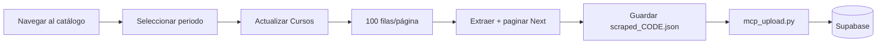

# Scraping de oferta USFQ con Playwright MCP

Guía de respaldo cuando `scrape.py` no funciona (sesión SSO expirada, headless bloqueado, etc.).  
Usa el servidor MCP **user-playwright** desde Cursor: el navegador queda autenticado con tu cuenta USFQ y el agente puede paginar y extraer datos.

> **Seguridad:** Las credenciales USFQ nunca salen de tu máquina. Este flujo es **solo local**; no subas `.browser_profile/`, `.env` ni `scraped_*.json` a GitHub.

---

## Requisitos

1. MCP **user-playwright** habilitado en Cursor.
2. Sesión USFQ activa en el navegador MCP (ver paso 1).
3. Archivo `offer-scraper/.env` con `SUPABASE_URL` y `SUPABASE_KEY` (anon o service).
4. Python venv en `offer-scraper/` (`pip install -r requirements.txt`).

---

## Flujo resumido



| Acción | Comando upload |
|--------|----------------|
| Periodo histórico (semestres pasados) | `--target history` |
| Periodo actual (reemplaza `course_offer`) | `--target current` |
| Rollover (archivar actual → cargar nuevo) | `--target rollover` |

---

## Paso 1 — Iniciar sesión en el navegador MCP

1. Pide al agente: *“Navega a https://catalogodecursos.usfq.edu.ec/dashboard/home con Playwright MCP”*.
2. Si redirige a login Microsoft, inicia sesión manualmente en la ventana del navegador.
3. Confirma que ves **“Bienvenido, …”** y el combobox **Periodos**.

La sesión del MCP es independiente del perfil `.browser_profile/` de `scrape.py`.

---

## Paso 2 — Scrapear un periodo

El script reutilizable está en `offer-scraper/mcp_scrape.js`.  
**Edita** las dos primeras constantes antes de ejecutar:

```javascript
const PERIOD_CODE = '202610';   // código numérico del periodo
const PERIOD_LABEL = 'Primer Semestre 2026/2027';
```

Pide al agente que ejecute:

> *“Ejecuta `browser_run_code_unsafe` con el archivo `offer-scraper/mcp_scrape.js`”*

El script:

1. Abre el dashboard.
2. Selecciona el periodo en el `<select>`.
3. Clic en **Actualizar Cursos**.
4. Cambia paginación a **100** filas.
5. Recorre todas las páginas con **Next** y extrae NRC, horario, profesor, cupos, etc.

### Guardar el JSON localmente

El resultado es grande (~1 MB). Extrae el bloque `### Result` del output del MCP y guárdalo:

```bash
cd offer-scraper
python3 - <<'PY'
import json, sys
# Pegar ruta al archivo de output del MCP:
src = "/path/to/agent-tools/....txt"
text = open(src, encoding="utf-8").read()
start = text.index("### Result\n") + len("### Result\n")
end = text.find("\n### Ran Playwright", start)
data = json.loads(text[start:end].strip())
code = data["period_code"]
with open(f"scraped_{code}.json", "w", encoding="utf-8") as f:
    json.dump(data["courses"], f, ensure_ascii=False)
print(f"Guardado scraped_{code}.json — {data['count']} cursos")
PY
```

---

## Paso 3 — Subir a Supabase

```bash
cd offer-scraper

# Histórico (semestres anteriores → course_offer_history)
.venv/bin/python mcp_upload.py scraped_202510.json \
  --period "Primer Semestre 2025/2026" --period-code 202510 --target history

.venv/bin/python mcp_upload.py scraped_202520.json \
  --period "Segundo Semestre 2025/2026" --period-code 202520 --target history

# Rollover: archiva Verano actual en history, limpia course_offer, carga nuevo periodo
.venv/bin/python mcp_upload.py scraped_202610.json \
  --period "Primer Semestre 2026/2027" --period-code 202610 --target rollover
```

Si el rollover falla por permisos RLS del anon key, el agente puede completar con SQL admin (ver abajo).

---

## Periodos de referencia (`periods.json`)

| Código | Etiqueta |
|--------|----------|
| 202610 | Primer Semestre 2026/2027 |
| 202520 | Segundo Semestre 2025/2026 |
| 202510 | Primer Semestre 2025/2026 |
| 202530 | Verano 2025/2026 |
| 202630 | Verano 2026/2027 |

Lista completa en el combobox del catálogo (puede cambiar cada año).

---

## Rollover manual (SQL admin)

Cuando `mcp_upload.py --target rollover` no puede archivar/limpiar por permisos del anon key:

```sql
-- 1. Archivar filas de verano que aún estén en course_offer
INSERT INTO course_offer_history (...)
SELECT ... FROM course_offer co
WHERE co.period_code = '202530'
  AND NOT EXISTS (
    SELECT 1 FROM course_offer_history h
    WHERE h.period_code = '202530' AND h.nrc = co.nrc
  );

-- 2. Quitar verano del snapshot actual
DELETE FROM course_offer WHERE period_code = '202530';

-- 3. Actualizar metadata
UPDATE offer_metadata SET
  current_period_code = '202610',
  current_period_label = 'Primer Semestre 2026/2027',
  last_scraped_at = now(),
  last_rollover_at = now(),
  updated_at = now()
WHERE id = 1;
```

---

## Solución de problemas

| Problema | Qué hacer |
|----------|-----------|
| Redirige a login | Inicia sesión manual en el navegador MCP y repite. |
| `raw is not iterable` | Usar `page.evaluate(() => { ... })` inline (no pasar función externa). |
| Upsert history falla `42P10` | `upload_to_history` ahora borra+inserta por periodo; re-ejecutar upload. |
| `401 permission denied` en DELETE | Usar service role key en `.env` o SQL admin vía Supabase MCP. |
| Pocas filas en verano en history | El rollover por upsert reemplaza NRCs compartidos; re-scrapear 202530 con `--target history` si hace falta el snapshot completo. |

---

## Cuándo volver a `scrape.py` (Selenium)

El scraper Python usa **Selenium + Chrome** con perfil persistente en `.browser_profile/`.
El auto-login corre **una sola vez** por ejecución (sin loop).

```bash
cd offer-scraper
pip install -r requirements.txt

# Primera vez / sesión expirada (~30 h)
python scrape.py login

# Scrape normal (headless)
python scrape.py scrape

# Backfill histórico
python scrape.py backfill --only 202510,202520

# Rollover automatizado
python scrape.py rollover --period-code 202610 --period "Primer Semestre 2026/2027" --yes
```

Requiere migración `20260627000001_scraper_write_grants.sql` aplicada para que el anon key pueda escribir.

---

## Archivos locales (gitignored)

- `scraped_*.json` — dumps por periodo
- `.browser_profile/` — sesión Chromium de scrape.py
- `.env` — credenciales
